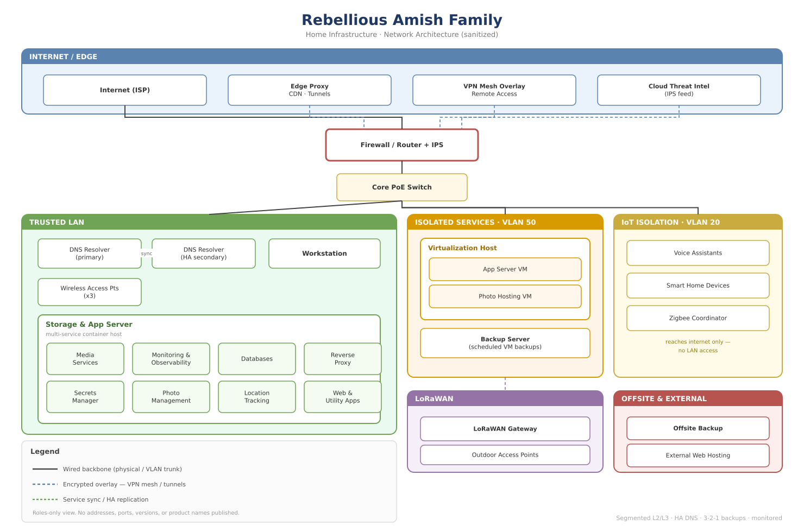

# Environment Overview

*Roles-only view — no addresses, ports, versions, or product names published. See the [note on redactions](../README.md) for why.*

A single-owner setup that runs personal services plus the production side of a
few public-facing community platforms. What I care about, roughly in order:
keeping it up (real people use it), keeping it locked down (it's public and it's
mine), and being able to see problems on a dashboard instead of hearing about
them from a member.

## Hosts (what they do, not a full inventory)
- **Proxmox + PBS** — VMs and containerized workloads, with backups pushed off
  to a separate box rather than sitting on the same host.
- **Unraid** — bulk storage plus a big Docker estate: media automation,
  monitoring, reverse proxy, secrets, Tailscale exit node.
- **pfSense** — perimeter, VLANs, intrusion prevention.
- **Pi-hole HA pair** — primary + secondary DNS with config sync, so losing
  either one doesn't take DNS down.
- **UniFi** — multi-AP wireless, channels and power tuned.

## Network
- A trusted LAN for everyday devices.
- A separate VLAN for services I don't want sharing a broadcast domain with the
  everyday stuff.
- Tailscale for remote access and for reaching things that are deliberately not
  on the internet (the secrets manager, for one).
- Cloudflare in front of the handful of services that are actually meant to be
  reachable from outside.

## Backups
3-2-1 shape. A primary backup server as the first copy, a second independent
copy pulled to separate storage, with retention and verification on a schedule
rather than assumed.

## Monitoring
Health, uptime and power are all instrumented (Grafana, Prometheus, netdata,
Uptime Kuma, UPS monitoring) so I can catch the slow-degradation stuff, not just
hard-down. A couple of the incidents in here got caught that way.

> Addresses in this repo are shown as generic RFC1918. The real internal
> addressing isn't published.
